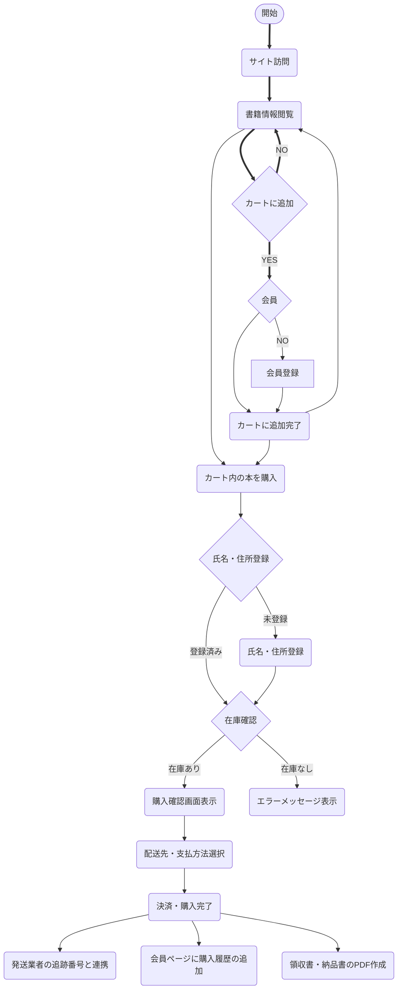

```mermaid
flowchart TB
  node_1(["開始"])
  node_2("サイト訪問")
  node_3("書籍情報閲覧")
  node_4{"カートに追加"}
  node_5{"会員"}
  node_7["会員登録"]
  node_8("カートに追加完了")
  node_10("カート内の本を購入")
  node_11{"氏名・住所登録"}
  node_6{"在庫確認"}
  node_9("氏名・住所登録")
  node_12("購入確認画面表示")
  node_13("エラーメッセージ表示")
  node_14("配送先・支払方法選択")
  node_15("決済・購入完了")
  node_16("発送業者の追跡番号と連携")
  node_17("会員ページに購入履歴の追加")
  node_18("領収書・納品書のPDF作成")
  node_1 ==> node_2
  node_2 ==> node_3
  node_3 ==> node_4
  node_4 =="YES"==> node_5
  node_4 =="NO"==> node_3
  node_5 --"NO"--> node_7
  node_3 --> node_10
  node_8 --> node_10
  node_8 --> node_3
  node_10 --> node_11
  node_5 --> node_8
  node_7 --> node_8
  node_11 --"登録済み"--> node_6
  node_11 --"未登録"--> node_9
  node_9 --> node_6
  node_6 --"在庫あり"--> node_12
  node_6 --"在庫なし"--> node_13
  node_12 --> node_14
  node_14 --> node_15
  node_15 --> node_16
  node_15 --> node_17
  node_15 --> node_18
``` 

