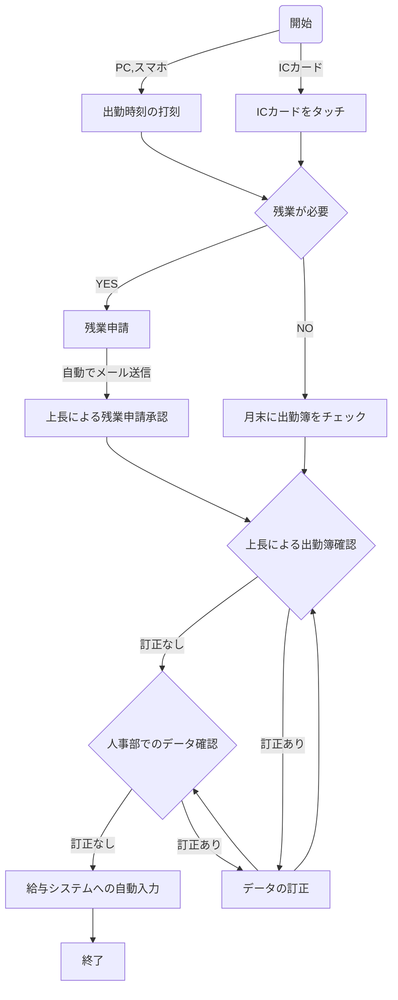

```mermaid
flowchart TB
  node_1("開始")
  node_2["出勤時刻の打刻"]
  node_3["ICカードをタッチ"]
  node_4{"残業が必要"}
  node_5["残業申請"]
  node_6["上長による残業申請承認"]
  node_7["月末に出勤簿をチェック"]
  node_8{"上長による出勤簿確認"}
  node_9{"人事部でのデータ確認"}
  node_10["給与システムへの自動入力"]
  node_11["終了"]
  node_12["データの訂正"]
  node_1 --"PC,スマホ"--> node_2
  node_1 --"ICカード"--> node_3
  node_2 --> node_4
  node_4 --"YES"--> node_5
  node_5 --"自動でメール送信"--> node_6
  node_4 --"NO"--> node_7
  node_6 --> node_8
  node_8 --"訂正なし"--> node_9
  node_9 --"訂正なし"--> node_10
  node_10 --> node_11
  node_3 --> node_4
  node_7 --> node_8
  node_8 --"訂正あり"--> node_12
  node_9 --"訂正あり"--> node_12
  node_12 --> node_9
  node_12 --> node_8
```
