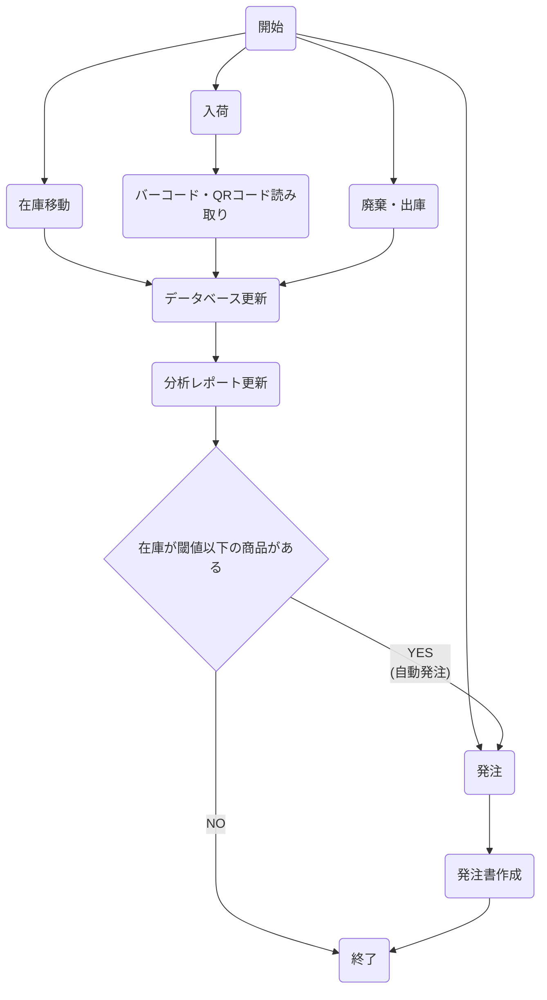

```mermaid
flowchart TB
  node_1("開始")
  node_2("入荷")
  node_3("在庫移動")
  node_4("廃棄・出庫")
  node_5("バーコード・QRコード読み取り")
  node_7("発注")
  node_8("データベース更新")
  node_10("発注書作成")
  node_6("分析レポート更新")
  node_9{"在庫が閾値以下の商品がある"}
  node_11("終了")
  node_1 --> node_2
  node_1 --> node_3
  node_1 --> node_4
  node_2 --> node_5
  node_1 --> node_7
  node_3 --> node_8
  node_7 --> node_10
  node_5 --> node_8
  node_4 --> node_8
  node_8 --> node_6
  node_6 --> node_9
  node_9 --"YES\n(自動発注)"--> node_7
  node_9 --"NO"--> node_11
  node_10 --> node_11
```

